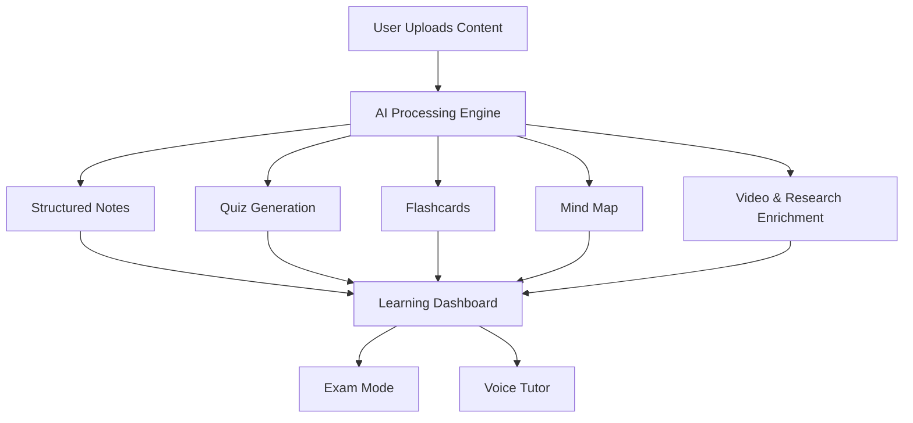

# 🚀 AutoLearn AI Studio

### Intelligent Multimodal Learning Platform

AutoLearn AI Studio is an AI-powered system that transforms raw learning content into **structured, interactive study material**. It enables users to upload PDFs, text, and other inputs, and instantly receive organized notes, quizzes, and enriched learning resources.

---

## 📌 Overview

Traditional tools stop at summarization. AutoLearn extends this by combining **content understanding, enrichment, and interaction** into a unified learning workflow.

The platform converts unstructured input into meaningful knowledge while enhancing it with **multimedia and research-backed context**.

---

## 🧠 How It Works



---

## ✨ Key Features

### 📥 Multimodal Input

* Upload **PDFs** or paste **text content**
* Automatic extraction and processing

---

### 📚 AI Learning Suite

Automatically generates:

* **Structured Notes** (chapter-wise)
* **MCQ-based Quizzes**
* **Flashcards**
* **Glossary of key terms**

---

### 🎯 Exam Mode

* Practice with **MCQ-based assessments**
* Difficulty levels:

  * Easy
  * Medium
  * Hard
* Designed for quick evaluation and revision

---

### 🎥 Multimedia Enrichment

* Fetches relevant **YouTube educational videos**
* Enhances learning with:

  * Visual explanations
  * Contextual resources

---

### 🎤 Voice-Enabled Learning

* Convert notes into **audio playback**
* Enables hands-free learning

---

### 🧠 Mind Map Generation

* Visual representation of concepts
* Helps in quick revision and concept linking
* Exportable with study material

---

### 🔍 Research Integration

* Integrated with:

  * Semantic Scholar
  * arXiv
* Provides:

  * Paper summaries
  * References for deeper exploration

---

### 📤 Share & Export

* Share sessions via link
* Export structured content as **clean, readable PDFs**

---

## 🏗️ System Architecture

```
Frontend (React + Vite)
        ↓
FastAPI Backend
        ↓
AI Processing Layer (Groq - Llama 3.3)
        ↓
RAG + External APIs + MongoDB
```

---

## ⚙️ Tech Stack

### 💻 Frontend

* React (Vite)
* Tailwind CSS
* React Query
* ShadCN UI

### ⚙️ Backend

* FastAPI
* MongoDB (Motor)
* JWT Authentication

### 🧠 AI & Processing

* Groq (Llama 3.3)
* RAG-based enrichment pipeline

### 🔌 Integrations

* YouTube Data API
* Pexels API
* Semantic Scholar
* arXiv
* Wikipedia
* DuckDuckGo
* Free Dictionary API

---

## 🚀 Getting Started

### 1️⃣ Clone Repository

```bash
git clone https://github.com/your-username/AutoLearn-AI.git
cd AutoLearn-AI
```

---

### 2️⃣ Backend Setup

```bash
cd backend
python -m venv venv
venv\Scripts\activate

pip install -r requirements.txt
```

---

### 3️⃣ Environment Variables

Create a `.env` file:

```
GROQ_API_KEY=
YOUTUBE_API_KEY=
PEXELS_API_KEY=
MONGODB_URL=
JWT_SECRET=
ELEVENLABS_API_KEY=
```

---

### 4️⃣ Run Backend

```bash
python -m uvicorn main:app --reload
```

---

### 5️⃣ Frontend Setup

```bash
cd ../frontend
npm install
npm run dev
```

---

## 🔄 Workflow

1. Upload content (PDF/Text)
2. AI processes and extracts information
3. Generates:

   * Notes
   * Quiz
   * Flashcards
4. Enhances with:

   * Videos
   * Images
   * Research data
5. User can:

   * Study
   * Practice
   * Export or share

---

## 📊 Use Cases

* Students (engineering, medical, etc.)
* Competitive exam preparation
* Self-learning and revision
* Technical concept understanding

---

## ⚠️ Limitations

* Requires internet connectivity
* Dependent on external APIs
* Performance may vary for large documents

---

## 🔮 Future Enhancements

* Additional exam formats (subjective, case-based)
* Advanced personalization
* Real-time collaboration
* Mobile application


